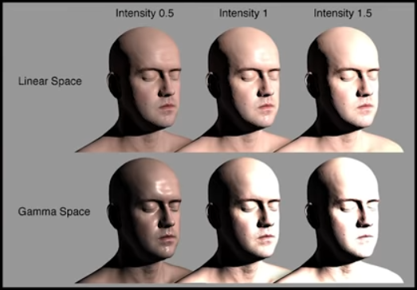
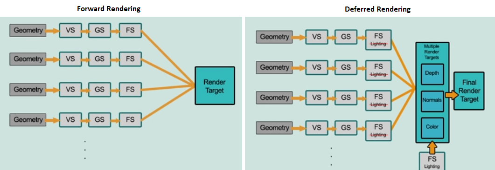
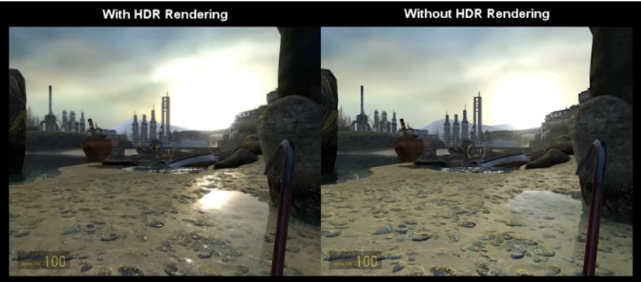
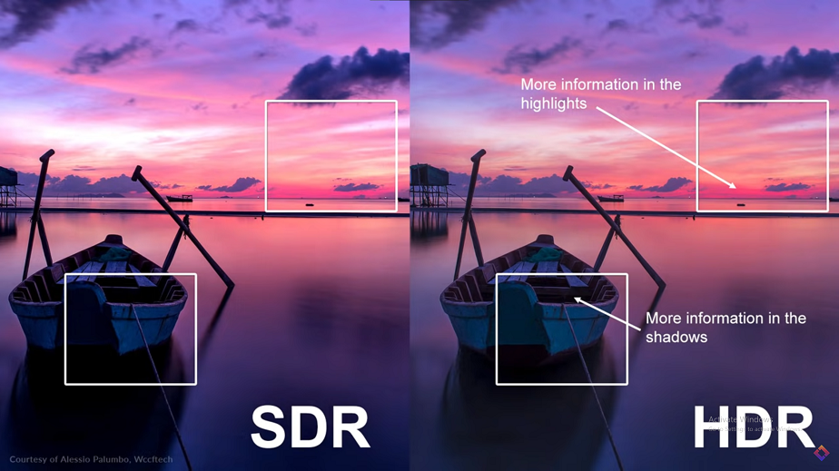
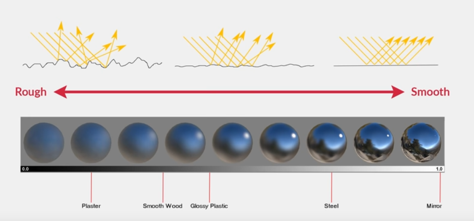
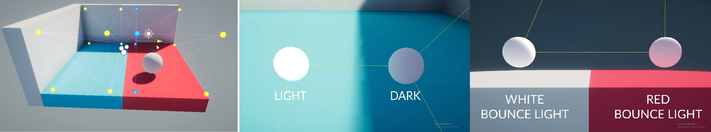

# Lighting

Reference

- [Brackeys: LIGHTING in Unity](https://youtu.be/VnG2gOKV9dw)
- [Brackeys: REALTIME LIGHTING in Unity](https://www.youtube.com/watch?v=wwm98VdzD8s)
- [Brackeys: How to get Good Graphics in Unity](https://www.youtube.com/watch?v=owZneI02YOU)
- [Brackeys: Photorealistic Materials in Unity](https://youtu.be/_LaVvGlkBDs?list=PLPV2KyIb3jR4GH32npxmkXE-AHnlamcdG)
- [Brackeys: How to get Volumetric Lighting in Unity 5](https://www.youtube.com/watch?v=H5v_X1k02U0)
- [Brackeys: How to get Good Graphics - Upgrading to HDRP](https://www.youtube.com/watch?v=12gkcdLc77s)
- [Brackeys: HIH QUALITY LIGHTING using Light Probes](https://www.youtube.com/watch?v=_E0JXOZDTKA)
- [Brackeys: REFLECTIONS in Unity](https://www.youtube.com/watch?v=lhELeLnynI8)

- [Lighting in Unity 5](https://dshankar.svbtle.com/lighting-in-unity-5)

## General Notes

Lighting types

- **Direct lighting**: Light directly enters eye from source.
- **Indirect lighting**: Light bounces before entering eye (aka. global illumination)

Terms

- **Baking**: Generates textures to represent light bounces, elimating the need for realtime-calculations. Generally best for static objects.
- **Progressive lightmapper**: Path-tracing-based lightmapper for baking. Can see results as it renders in editor, and can make realtime changes.
- **Two-point lighting**: When two sources of lighting are used; typically a `main light`, and a less-intense `rim light`.
- **Volumetric lighting**: Simulates light being scattered in the atmosphere due to particles, creating a 3D voluminous effect (e.g. dust/mist/smoke in the air)
- **Light probes**: Where baked lighting works for static objects, light probes allow advanced lighting calculations for dynamic objects.

### Baked Lighting

#### Baked Lighting Notes

- Emmisive materials do not cast light in realtime and require baking of a lightmap.
- Lightmaps will only bake for static objects.

- For indoors scenes, make sure to remove:

  - Directional lights
  - Skybox
  - Ambient lighting tints (set colour to black)

#### Troubleshooting

If we see seams on objects, this can be corrected by:

- Adjusting model import settings: Use `Generate Lightmap UVs` if a model has not been exported with UVs.
- On the `Mesh Renderer` enable `Stitch Seams`

If we see bleeding on objects (i.e. colouration in areas that shouldn't have that colour), this is due to the lightmap texture having generated separate areas close to each other. This can be avoided by increasing `Padding`/`Resolution`, or adjusting the `Filtering` settings.

If we see banding, adjust the lightmap `Compression`.

### Realtime Lighting

#### Realtime Lighting Notes

- Increasing `Quality settings > Pixel Light Count` will improve the rendering quality (e.g. 20 is a good value)
- Increase `Quality settings > Shadow quality` for improved shadows.

- `Lighting Settings`
  - Outdoors scenes: Use `Skybox`/`Gradient` as lightsource. Unity automatically applies realtime lighting based on the current skybox/gradient values.
  - Indoors scenes: Use `Color` as lightsource, and set to `black`.

- Emissive materials: As emissive materials do not contribute to realtime lighting, we fake this by adding a `Point Light` at/near the location of the emmissive.

- Point lights: Do not cast shadows. This can be faked by adding `Spot Lights` but consider the overhead.

- Post-processing: It's a good idea to include an `Ambient Occlusion` effect for realtime lighting.

---

### Graphics

- **Graphics** - visual fidelity. Rendering techniques.
- **Aethetics** - visual styling.

- **Color Space** - determines the math used in lighting calculations / reading values from textures.

  - **Linear space** - colours supplied to shaders will brighten linearly as light intensity increases. Typically provides more realistic results.
  - **Gamma space** - typically results in brighters colours blowing out to white, leading to a washed out look.

- **Rendering paths**

  - **Forward rendering** - each object is rendered in a *pass* for each object affected by a light. Depending on how many lights are in range, a single object can have multiple passes. Less performance overhead if there are fewer lights. (Good for mobile/VR)
  - **Deferred rendering** - render cost is proportional to the number of  pixels the light illuminates, instead of the lights themselves. Number of lights is no longer a limitation, however the up-front performance overhead is much more. (Good for desktop)

- **HDR (High Dynamic Range)** - determines how very bright/dark colours are captured by the camera in scene. Can capture colours in more precision than **LDR (low dynamic range)**, and keeps details in over/under exposed areas.

- **Tone mapping** - determines how HDR colour data maps to the screen's colour range. *(Note that if Filmic is applied it may be necessary to increase ambient lighting intensity etc. to achieve reasonable lighting)*

|||
|-|-|

- **PBR (Physically Based Rendering)** - rendering techniques that mimic real-world lighting behaviours.

  - Generally revolve around:

    - Reflectivity of light (smoothness - roughness, metallicness - reflectivity/tint)
    - Microsurfaces (small cracks, bumps, etc. that affect reflection.)
    - Fresnel (how reflectivity changes with angle. Higher angle to viewer = more light reflected. Effect decreases with surface roughness)

  - PBR workflows:

    - **Metallic** - based on defining how metallic/non-metallic a surface should be. Specualar highlight brightness/tint is calculated automatically. (typical properties: colour, metallicness, smoothness)
    - **Specular** - gives you direct control over brightness/tint of specular highlights.

  - Properties:

    - **Albedo** - raw colour of the material. Determines colour of diffused light.
    - **Metallic** - determines metallicness of surface. Higher metalicness will obscure the albedo.
    - **Smoothness** - how smooth or rough the microsurface is. Smoother with scatter light more evenly.
    - **Normal map** - adds surface detail without adding geometry by changing how light reflects off of surface.
    - **Height map** - similar to normal maps, but more intensive. Generally used together with normal map to show larger changes in surface level.
    - **Occlusion map** - adds ambient occlusion using black/white texture.
    - **Emission map** - adds emmissive properties.

    > Note that if a metallic texture map is assigned, we lose access to the smoothness channel as red channel = metalicness and alpha channel = smoothness.

### Light Probes

Baked lighting only works for static objects. Light probes can be used to apply lighting conditions to dynamic (moving) objects.

- When adding a light probe group, many individual light probes make up the group.
- Each light probe records information about the lighting at that position, such as intensity, colour bounces, etc.
- When placing probes, try to strategically prosition them at areas where light/colour changes drastically, so that these nuances between positions are recorded and applied.
- When a dynamic object moves throughout the group, the lighting information is applied to the object (interpolated between probes).

> Note that each light probe is a white sphere that actively displays the calculated lighting. Thus, each probe in scene can be inspected to see lighting at that point.

> Note that when moving a dynamic object around in scene view, Unity will display the active light probes that are currently influencing it.

### Reflections

#### Reflection Probes

- A reflection probe acts as a 360-degree camera at a point in space. 
- The captured image (distance determined by the bounding volume) is rendered as a cube map. 
- The cupe map is then overlaid on nearby objects to create a reflection.

> Notes
>
> - Baked reflection will use static objects. Note that when marking objects as static, we can use the dropdown to be more specific, and target reflections only if we wish.
> - Realtime reflections will render all objects. Use a culling mask to eliminate items that we don't want to reflect.
>
> The downside to reflection probes is that it is an approximation of reflection, and isn't very accurate for smaller details/objects.

#### Screen Space Reflections

A post-processing effect that is used to crate more subtle reflections. Objects typically line up with their reflections, which gives them an advantage over probes. 

---

## Tips

Making Unity 2017 look great:

- Player Settings
  - Color Space: Linear
- Lighting Settings
  - Set skybox (adds natural looking ambient light)
  - Consider lightmap baking
- Project Settings > Quality
  - Pixel Light Count = 15
  - Texture Quality = Full Res
  - Anisotropic filter = Forced On
  - Anti Aliasing = Disabled (prefer to use post-processing AA)
- Camera
  - MSSA = on
  - HDR = on
- Post-processing
  - Tone mapping
  - Ambient occlusion
  - Motion blur
  - Vignette
  - Fog
  - Anti-aliasing (temporal is smoothest.)
  - Eye adaption
  - Bloom
- Other effects
  - Reflection probes for realtime reflections
  - Emissive materials

> Note: Unreal Engine looks great because it uses post-processing by default. Typical settings to mimic are:
>
> - Tone mapping: Filmic
> - Vignette
> - Motion blur
> - Eye adaption
> - Temporal antialiasing