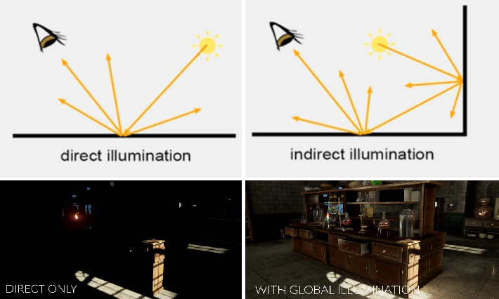

# Lighting

Reference

- [Brackeys: LIGHTING in Unity](https://youtu.be/VnG2gOKV9dw)

## Notes

Lighting types

- **Direct lighting**: Light directly enters eye from source.
- **Indirect lighting**: Light bounces before entering eye (aka. global illumination)

Terms

- **Baking**: Generates textures to represent light bounces, elimating the need for realtime-calculations. Generally best for static objects.
- **Progressive Lightmapper**: Path-tracing-based lightmapper for baking. Can see results as it renders in editor, and can make realtime changes.

### Baked Lighting

#### Baked Lighting Notes

- Emmisive materials do not cast light in realtime and require baking of a lightmap.
- Lightmaps will only bake for static objects.

- For indoors scenes, make sure to remove:

  - Directional lights
  - Skybox
  - Ambient lighting tints (set colour to black)

#### Troubleshooting

If we see seams on objects, this can be corrected by:

- Adjusting model import settings: Use `Generate Lightmap UVs` if a model has not been exported with UVs.
- On the `Mesh Renderer` enable `Stitch Seams`

If we see bleeding on objects (i.e. colouration in areas that shouldn't have that colour), this is due to the lightmap texture having generated separate areas close to each other. This can be avoided by increasing `Padding`/`Resolution`, or adjusting the `Filtering` settings.

If we see banding, adjust the lightmap `Compression`.
