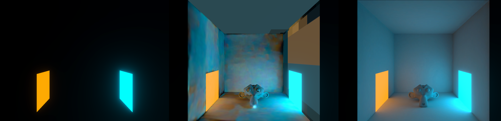

# Lighting

Reference

- [Brackeys: LIGHTING in Unity](https://youtu.be/VnG2gOKV9dw)
- [Brackeys: REALTIME LIGHTING in Unity](https://www.youtube.com/watch?v=wwm98VdzD8s)
- [Brackeys: How to get Good Graphics in Unity](https://www.youtube.com/watch?v=owZneI02YOU)

## Notes

Lighting types

- **Direct lighting**: Light directly enters eye from source.
- **Indirect lighting**: Light bounces before entering eye (aka. global illumination)

Terms

- **Baking**: Generates textures to represent light bounces, elimating the need for realtime-calculations. Generally best for static objects.
- **Progressive lightmapper**: Path-tracing-based lightmapper for baking. Can see results as it renders in editor, and can make realtime changes.
- **Two-point lighting**: When two sources of lighting are used; typically a `main light`, and a less-intense `rim light`.

### Baked Lighting

#### Baked Lighting Notes

- Emmisive materials do not cast light in realtime and require baking of a lightmap.
- Lightmaps will only bake for static objects.

- For indoors scenes, make sure to remove:

  - Directional lights
  - Skybox
  - Ambient lighting tints (set colour to black)

#### Troubleshooting

If we see seams on objects, this can be corrected by:

- Adjusting model import settings: Use `Generate Lightmap UVs` if a model has not been exported with UVs.
- On the `Mesh Renderer` enable `Stitch Seams`

If we see bleeding on objects (i.e. colouration in areas that shouldn't have that colour), this is due to the lightmap texture having generated separate areas close to each other. This can be avoided by increasing `Padding`/`Resolution`, or adjusting the `Filtering` settings.

If we see banding, adjust the lightmap `Compression`.

### Realtime Lighting

#### Realtime Lighting Notes

- Increasing `Quality settings > Pixel Light Count` will improve the rendering quality (e.g. 20 is a good value)
- Increase `Quality settings > Shadow quality` for improved shadows.

- `Lighting Settings`
  - Outdoors scenes: Use `Skybox`/`Gradient` as lightsource. Unity automatically applies realtime lighting based on the current skybox/gradient values.
  - Indoors scenes: Use `Color` as lightsource, and set to `black`.

- Emissive materials: As emissive materials do not contribute to realtime lighting, we fake this by adding a `Point Light` at/near the location of the emmissive.

- Point lights: Do not cast shadows. This can be faked by adding `Spot Lights` but consider the overhead.

- Post-processing: It's a good idea to include an `Ambient Occlusion` effect for realtime lighting.
