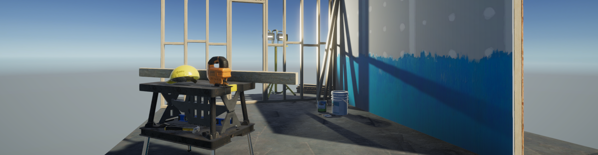

# Playground

This repository contains various projects and is used as a sandbox for experimentation.



## Sub-projects

The following folder hierarchy convention is to be used for sub-projects within this repo:

```txt
+-- Assets
|   +-- Common
|   +-- Submodules
|   +-- [ProjectName]
```

where each sub-project is ideally a mostly-self-contained project that can make use of any Common or submodule assets.

A branching strategy is used for each sub-project. Branches should never be deleted once merged. This allows the Unity project version to be upgraded as necessary, while maintaining an easily accessible history of sub-projects, should these projects stop working in newer versions of Unity.

```txt
- main                   // Main branch
- develop                // Integration branch for all sub-projects.
- project/project-name   // Contains commits specific to each sub-project.
```

### Common / Submodules

Contains common assets for use within other sub-projects.

### Lighting

Demonstrates various lighting techniques.
[Link](./Assets/Lighting/README.md)

### URP Template

The URP template was generated when creating this project. This has been included as an example of scene lighting, as well as reusable assets.